# **Traffic Sign Recognition** 

## Writeup

---

**Build a Traffic Sign Recognition Project**

The goals / steps of this project are the following:
* Load the data set (see below for links to the project data set)
* Explore, summarize and visualize the data set
* Design, train and test a model architecture
* Use the model to make predictions on new images
* Analyze the softmax probabilities of the new images
* Summarize the results with a written report

---
### Writeup / README

#### 1. Provide a Writeup / README that includes all the rubric points and how you addressed each one. You can submit your writeup as markdown or pdf. You can use this template as a guide for writing the report. The submission includes the project code.

You're reading it! and here is a link to my [project code](https://github.com/udacity/CarND-Traffic-Sign-Classifier-Project/blob/master/Traffic_Sign_Classifier.ipynb)

### Data Set Summary & Exploration

#### 1. Provide a basic summary of the data set. In the code, the analysis should be done using python, numpy and/or pandas methods rather than hardcoding results manually.

I used the numpy library to calculate summary statistics of the traffic
signs data set:

* The size of training set is 34799
* The size of the validation set is 4410
* The size of test set is 12630
* The shape of a traffic sign image is (32, 32, 3)
* The number of unique classes/labels in the data set is 43

#### 2. Include an exploratory visualization of the dataset.

Here is an exploratory visualization of the data set. 
The pictures are randomly selected from the train examples.
The bar chart shows the number of train examples for each class.

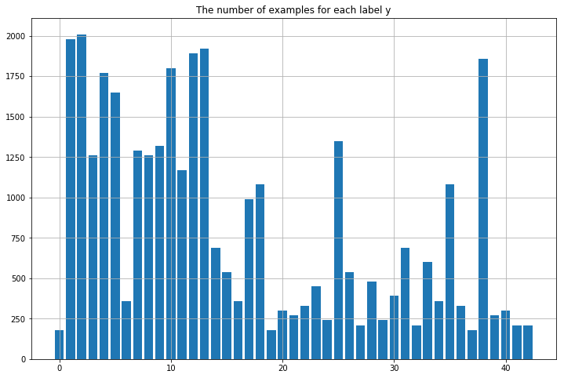

### Design and Test a Model Architecture

#### 1. Describe how you preprocessed the image data. What techniques were chosen and why did you choose these techniques? Consider including images showing the output of each preprocessing technique. Pre-processing refers to techniques such as converting to grayscale, normalization, etc. (OPTIONAL: As described in the "Stand Out Suggestions" part of the rubric, if you generated additional data for training, describe why you decided to generate additional data, how you generated the data, and provide example images of the additional data. Then describe the characteristics of the augmented training set like number of images in the set, number of images for each class, etc.)

As a first step, I decided to generate additional data because I realized that the number of traffic examples for some classes is not enough. I added 1000 examples to the classes which have no more than examples. 
I used rotation and blur to generate train examples. Rotation can simulate the pictures took from different angles to add the diversity of train data. I also found that there are some pictures unclear in the train examples, so I think using blur can add more unclear pictures to train the neural network better.
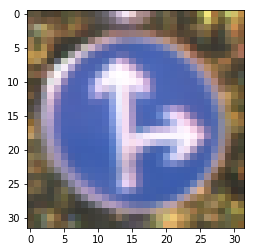
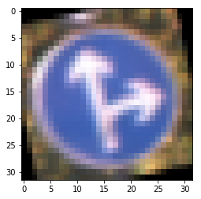

Then I converted all images to grayscale, because I got this idea from the paper Traffic Sign Recognition with Multi-Scale Convolutional Networks.
After implementing grayscale images, the network was trained better.
Here is an example of a traffic sign image before and after grayscaling.

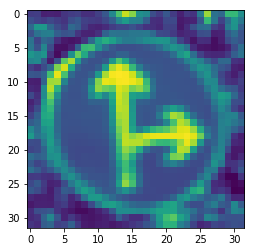

#### 2. Describe what your final model architecture looks like including model type, layers, layer sizes, connectivity, etc.) Consider including a diagram and/or table describing the final model.

My final model consisted of the following layers:

| Layer         		|     Description	        					| 
|:---------------------:|:---------------------------------------------:| 
| Input         		| 32x32x1 gray image   							| 
| Convolution 5x5     	| 1x1 stride, valid padding, outputs 28x28x32 	|
| RELU					|												|
| Max pooling	(x1)    | 2x2 stride,  outputs 14x14x32 				|
| Convolution 5x5     	| 1x1 stride, valid padding, outputs 10x10x64 	|
| RELU					|												|
| Max pooling (x2)	    | 2x2 stride,  outputs 5x5x64 					|
| flatten(x1)			| outputs 6272 									|
| flatten(x2)			| outputs 1600 									|
| concat(x1 + x2)		| outputs 7872 									|
| dropout				| Keep probability 0.8							|
| Fully connected		| outputs 300  									|
| RELU					|												|
| Fully connected		| outputs 120  									|
| RELU					|												|
| Fully connected		| outputs 43  									|
 

#### 3. Describe how you trained your model. The discussion can include the type of optimizer, the batch size, number of epochs and any hyperparameters such as learning rate.

To train the model, I set the number of epochs to 30, batch size to 128, learning rate to 0.001 and I used Adam optimizer.

#### 4. Describe the approach taken for finding a solution and getting the validation set accuracy to be at least 0.93. Include in the discussion the results on the training, validation and test sets and where in the code these were calculated. Your approach may have been an iterative process, in which case, outline the steps you took to get to the final solution and why you chose those steps. Perhaps your solution involved an already well known implementation or architecture. In this case, discuss why you think the architecture is suitable for the current problem.

My final model results were:
* training set accuracy of 99.6%
* validation set accuracy of 95.1%
* test set accuracy of 92.5%

For the first architecture, I just copied LeNet from last exercise. The validation accuracy was only 89%. Then I converted images to grayscale, the validation accuracy was improved to 90%. And I changed the number of filters of first layer from 6 to 108 and the number of filters of second layer from 16 to 108. The validation accuracy was 92%. After that, I modified LeNet to multi-scale CNN, concatenated the output of first layer and second layer. However, the validation accuracy was very low and it seemed it was overfitting because too many parameters. Therefore, I reduced the number of filters of first layer and second layer to 32 and 64. I also added dropout to prevent overfitting and generated more images by rotation and blur to increase diversity of training data. Finally, the final model worked well. The validation accuracy was 95.1%.

 
### Test a Model on New Images

#### 1. Choose five German traffic signs found on the web and provide them in the report. For each image, discuss what quality or qualities might be difficult to classify.

Here are five German traffic signs that I found on the web:
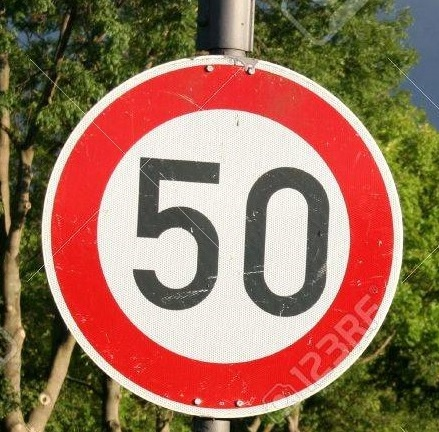                  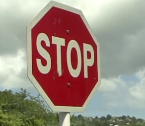
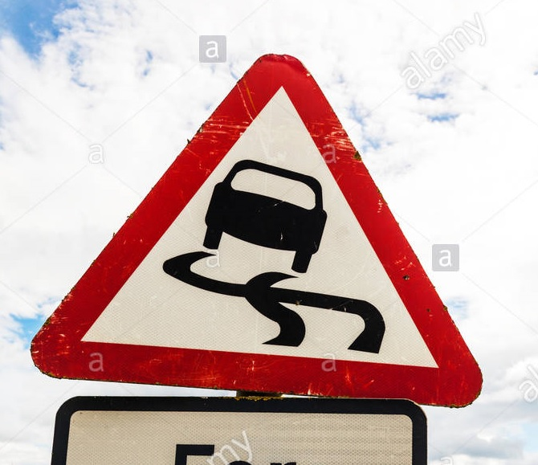                  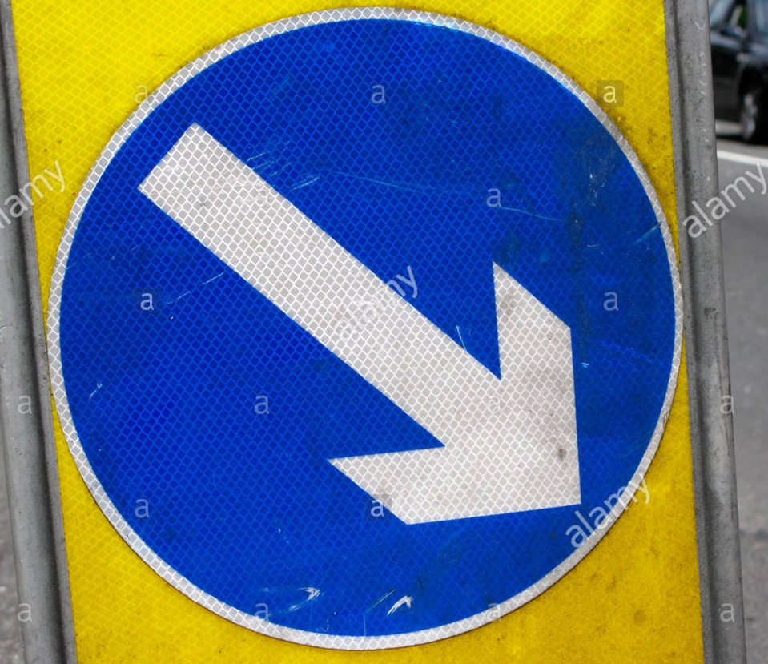
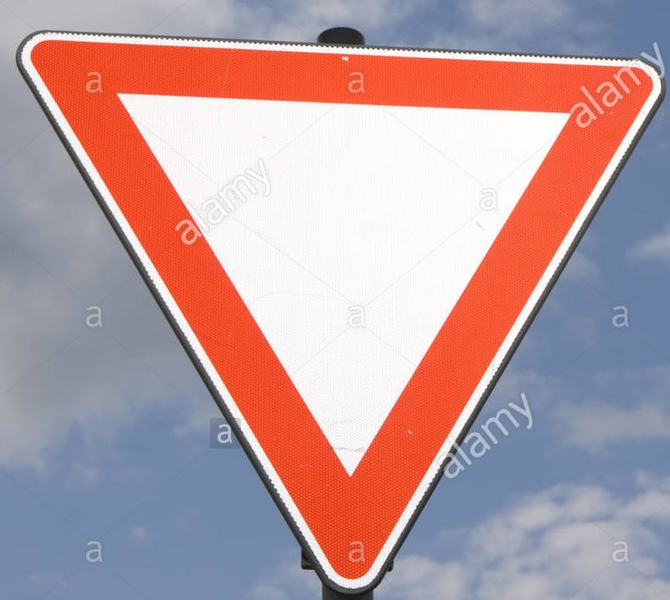                  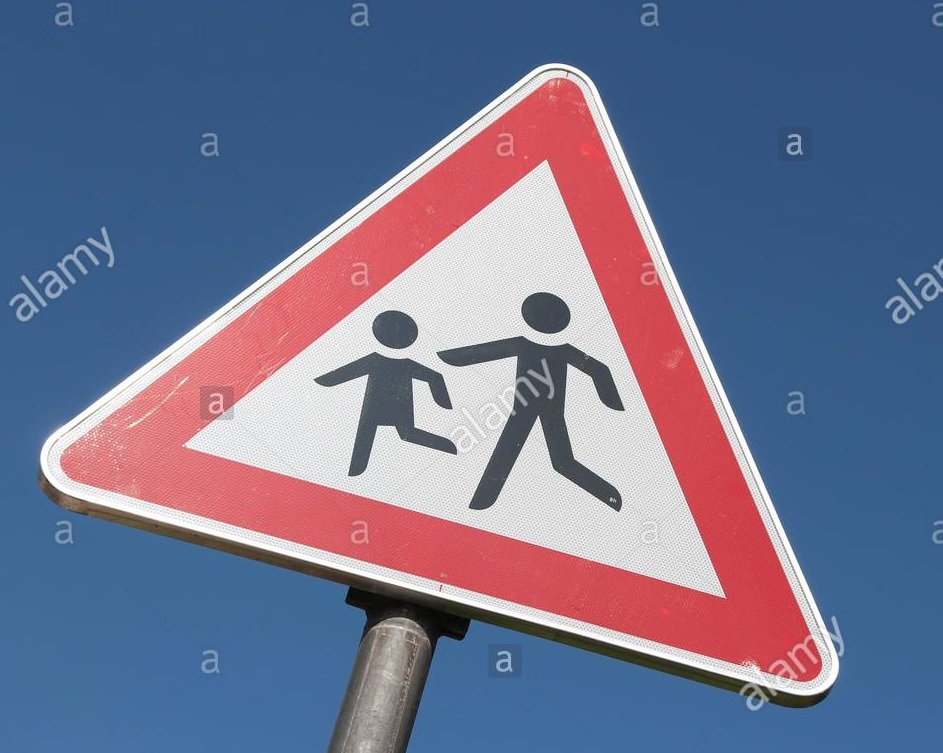
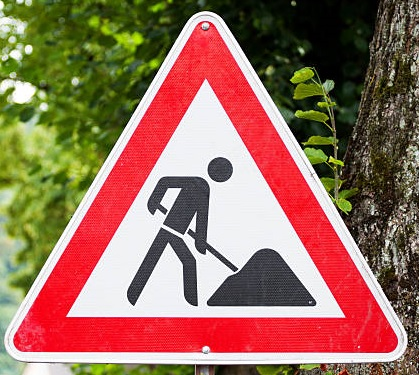                  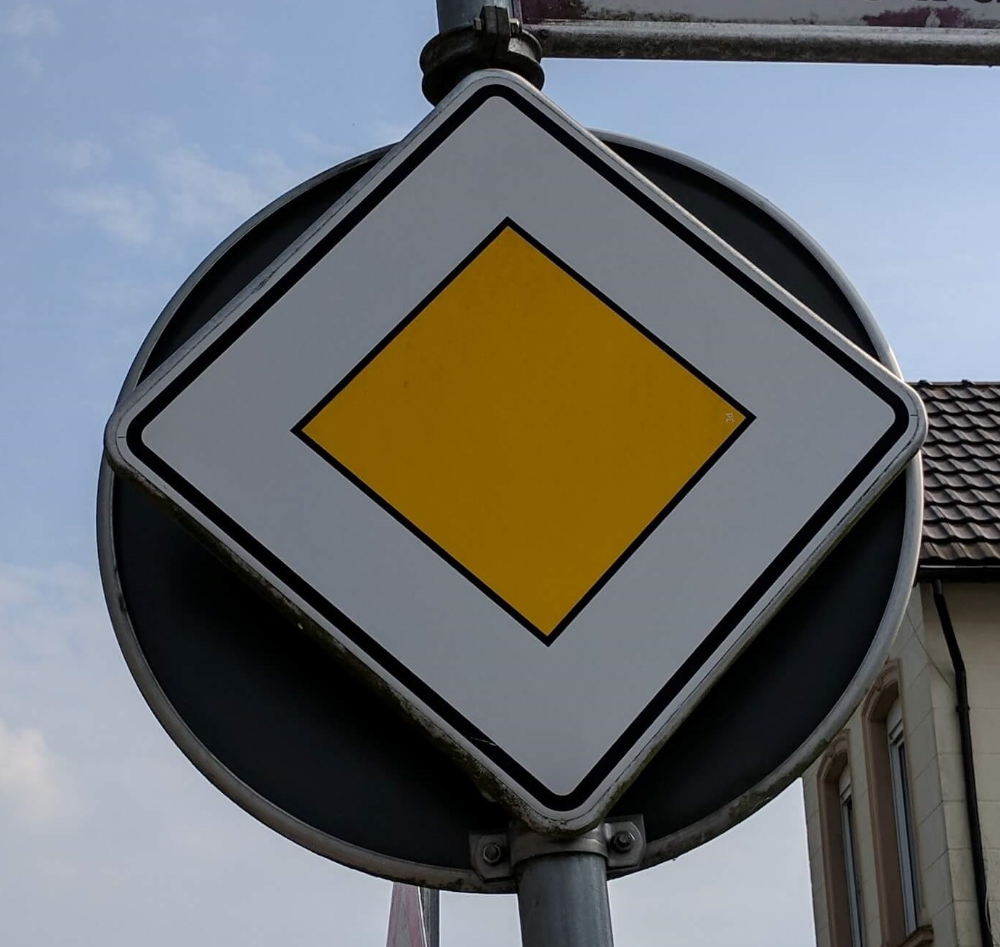
The first image might be difficult to classify because ...

#### 2. Discuss the model's predictions on these new traffic signs and compare the results to predicting on the test set. At a minimum, discuss what the predictions were, the accuracy on these new predictions, and compare the accuracy to the accuracy on the test set (OPTIONAL: Discuss the results in more detail as described in the "Stand Out Suggestions" part of the rubric).

Here are the results of the prediction:

| Image			              |     Prediction	        				| 
|:---------------------:|:--------------------------:| 
| Speed limit(50km/h) 	 | Speed limit(50km/h)  						| 
| Road work    	      		| Road work 							        		|
| Priority road		       | Priority road					     				|
| Yield	      		       	| Yield					 						          |
| Keep right		  	       | Keep right      		   						|
| Stop				             	| Stop      							        		|
| Slippery Road		      	| Speed limit(30km/h)     			|
| Children crossing	   	| Priority road      						  |

The model was able to correctly guess 6 of the 8 traffic signs, which gives an accuracy of 75%. The accuracy is lower than the accuracy on the test set of 92.5%. However, there are only 8 images. The Children crossing sign wasn't detected correctly by the model, because the picture wasn't took by front view. I think if I warp images by using what I learned in the previous project to generate more training data, the model will work better. Moreover, Slippery Road was detected as Speed limit(30km/h). It seems that the model is not good at recognize the signs which have blur pattern inside. I think I can try to change the number of layers and the number of filters, maybe I can find another solution.  

#### 3. Describe how certain the model is when predicting on each of the five new images by looking at the softmax probabilities for each prediction. Provide the top 5 softmax probabilities for each image along with the sign type of each probability. (OPTIONAL: as described in the "Stand Out Suggestions" part of the rubric, visualizations can also be provided such as bar charts)

The code for making predictions on my final model is located in the 19th cell of the Ipython notebook.
---
First image

Speed limit (50km/h):

Prediction and Probability

Speed limit (50km/h) 100.00%

Speed limit (30km/h) 0.00%

Speed limit (60km/h) 0.00%

---
Second image

Road work:

Prediction and Probability

Road work 100.00%

Speed limit (20km/h) 0.00%

Speed limit (30km/h) 0.00%

---
Third image

Priority road:

Prediction and Probability

Priority road 100.00%

Keep right 0.00%

Roundabout mandatory 0.00%

---
Fourth image 

Yield:

Prediction and Probability

Yield 100.00%

Speed limit (20km/h) 0.00%

Speed limit (30km/h) 0.00%

---
Fifth image

Keep right:

Prediction and Probability

Keep right 100.00%

Speed limit (20km/h) 0.00%

Speed limit (30km/h) 0.00%

---
Sixth image

Stop:

Prediction and Probability

Stop 100.00%

Keep right 0.00%

Turn left ahead 0.00%

---
Seventh image

Slippery road:

Prediction and Probability

Speed limit (30km/h) 99.99%

Road work 0.01%

Speed limit (50km/h) 0.00%

---
Eighth image

Children crossing:

Prediction and Probability

Priority road 66.59%

Bicycles crossing 29.24%

Keep right 2.37%

---

### (Optional) Visualizing the Neural Network (See Step 4 of the Ipython notebook for more details)
#### 1. Discuss the visual output of your trained network's feature maps. What characteristics did the neural network use to make classifications?

